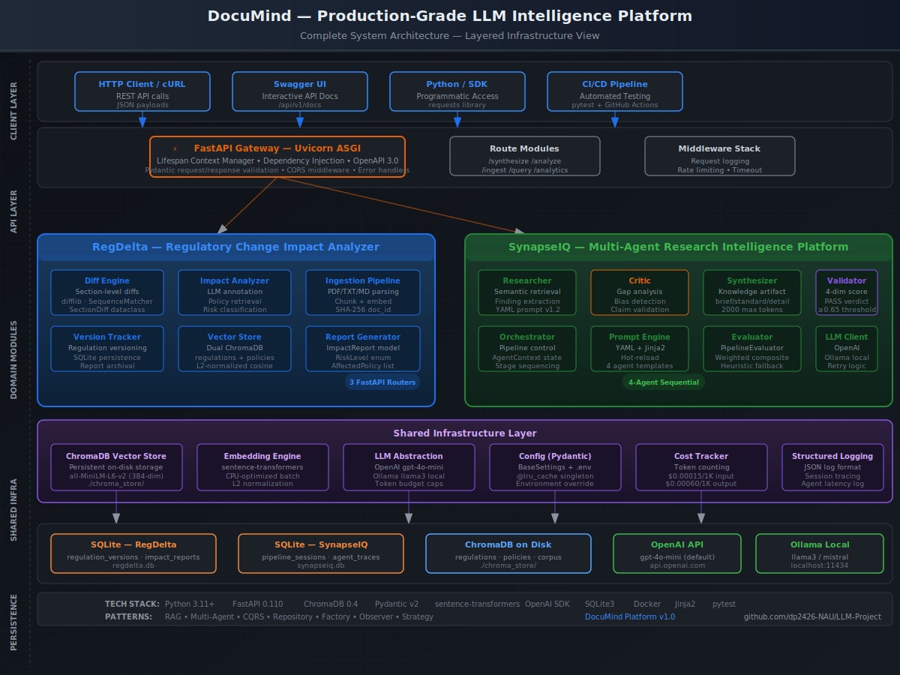
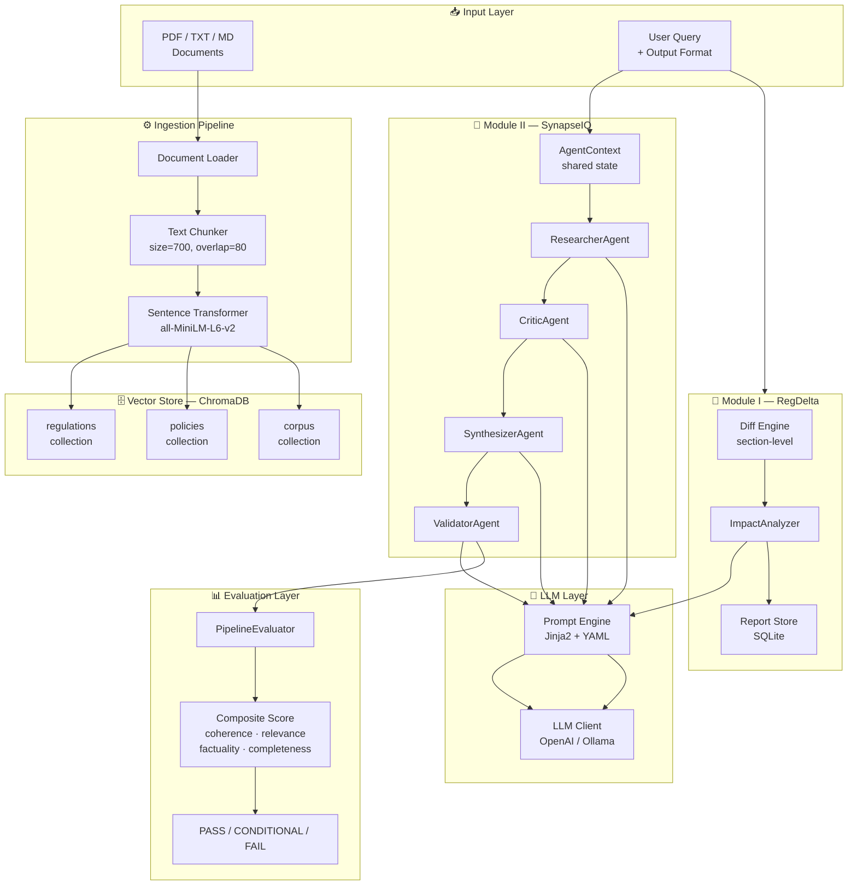
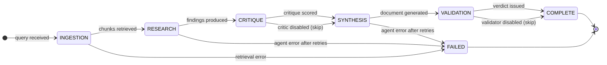
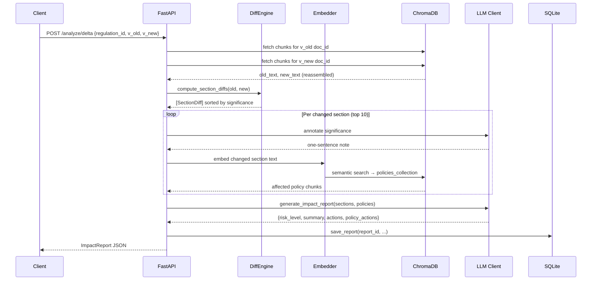
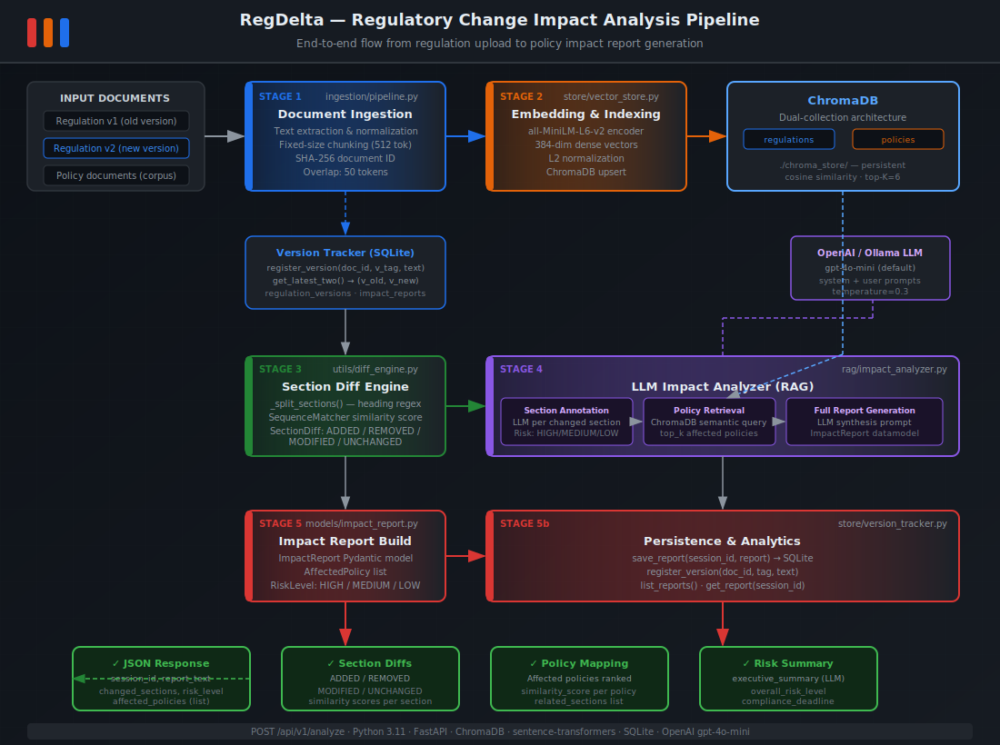
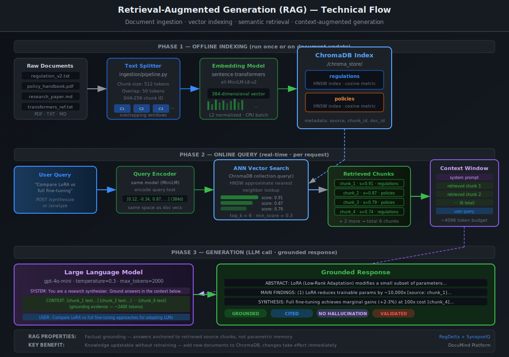
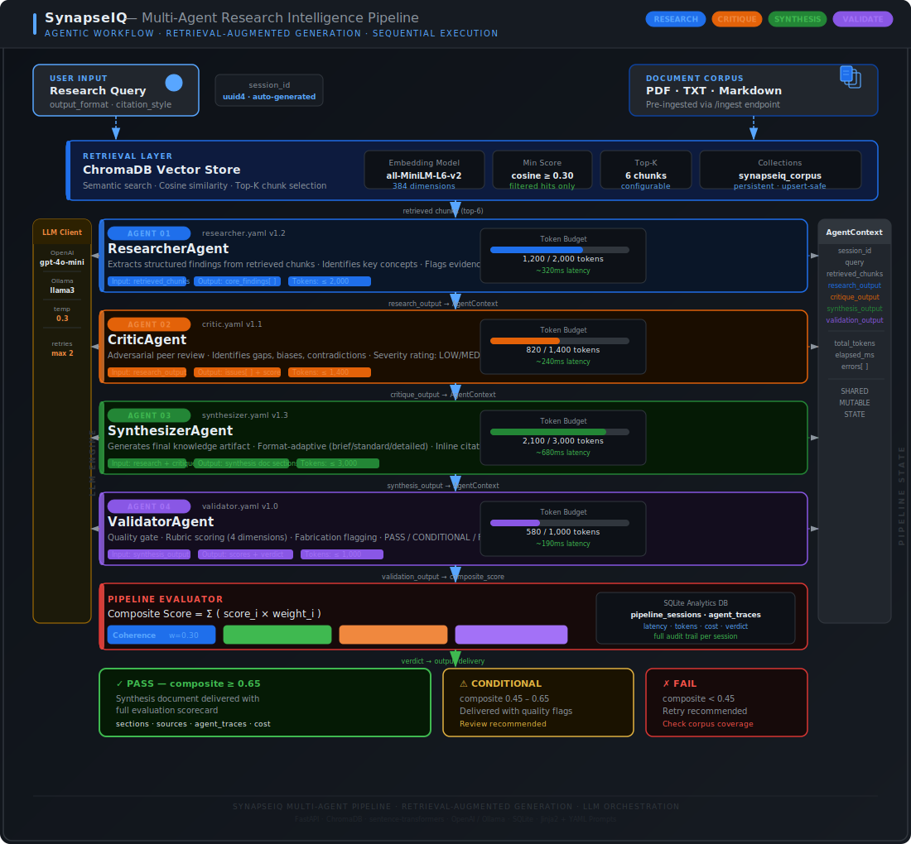

<div align="center">

# DocuMind — Production-Grade LLM Intelligence Platform

### Regulatory Change Analysis · Multi-Agent Knowledge Synthesis · Retrieval-Augmented Generation

[](https://python.org)
[](https://fastapi.tiangolo.com)
[](https://trychroma.com)
[](https://openai.com)
[](LICENSE)

*A unified enterprise AI platform implementing RAG pipelines and multi-agent LLM architectures for real-world document intelligence.*

**[🌐 Live Project Site](https://dp2426-nau.github.io/LLM-Project/)** · **[📄 Project Proposal](docs/proposal.md)** · **[📚 Full Documentation](docs/documentation.md)** · **[📊 Presentation Slides](docs/presentation.md)**

</div>

---

## Table of Contents

| # | Section | Description |
|---|---------|-------------|
| 1 | [Core Challenge Definition](#1-core-challenge-definition) | Problem context and motivation |
| 2 | [Mission Objectives & Success Targets](#2-mission-objectives--success-targets) | Goals and measurable outcomes |
| 3 | [System Coverage & Operational Boundaries](#3-system-coverage--operational-boundaries) | Scope, constraints, and assumptions |
| 4 | [3D System Blueprint & Structural Visualization](#4-3d-system-blueprint--structural-visualization) | Architecture diagrams and data flow |
| 5 | [Codebase Layered Engineering Map](#5-codebase-layered-engineering-map) | Full folder structure breakdown |
| 6 | [Component-Level Functional Deep Dive](#6-component-level-functional-deep-dive) | Module walkthrough |
| 7 | [Performance Benchmarking Framework](#7-performance-benchmarking-framework) | Evaluation metrics |
| 8 | [Data Engineering & Dataset Strategy](#8-data-engineering--dataset-strategy) | Corpus design and ingestion |
| 9 | [Technology Stack & Engineering Ecosystem](#9-technology-stack--engineering-ecosystem) | Tools and frameworks |
| 10 | [System Bootstrapping & Deployment Guide](#10-system-bootstrapping--deployment-guide) | Setup and run instructions |
| 11 | [Validation, Unit Testing & QA Pipeline](#11-validation-unit-testing--qa-pipeline) | Testing guide |
| 12 | [Execution Phases & Development Roadmap](#12-execution-phases--development-roadmap) | Milestones and timeline |
| 13 | [System Output & Real-World Impact](#13-system-output--real-world-impact) | Expected outcomes |
| 14 | [Resource Utilization & Optimization Strategy](#14-resource-utilization--optimization-strategy) | Budget and cost control |
| 15 | [Research Papers, Tools & Technical Citations](#15-research-papers-tools--technical-citations) | References |

---

## 1. Core Challenge Definition

### The Problem

Organizations operating in regulated industries — finance, healthcare, law, and government — generate and consume enormous volumes of structured and unstructured documents daily. Two critical knowledge-work bottlenecks remain unsolved at scale:

**Bottleneck A — Regulatory Change Propagation**

When a regulatory body (SEC, FINRA, Basel Committee) amends a rule, compliance teams must manually cross-reference hundreds of internal policy documents to identify what needs updating. This process:
- Takes **2–4 weeks** per major rule change at mid-size firms
- Is **error-prone** under deadline pressure
- Produces **no audit trail** linking policy gaps to specific regulatory clauses
- Scales **linearly** with the size of both the regulation corpus and policy inventory

**Bottleneck B — Research Synthesis at Scale**

Analysts, researchers, and knowledge workers spend the majority of their time reading, extracting, and synthesizing information from large document corpora into coherent reports. Current LLM-based tools (simple Q&A chatbots, document summarizers) retrieve relevant content but do not:
- Reason about **logical gaps and contradictions** in retrieved information
- Apply **structured critique** before producing a final synthesis
- **Self-evaluate** output quality before delivery
- Maintain a **traceable reasoning chain** from raw source to final artifact

### Why Existing Solutions Fall Short

| Approach | Limitation |
|----------|------------|
| Simple RAG chatbots | Returns chunks, not synthesized analysis; no quality gate |
| Document summarizers | Single-document scope; no cross-document reasoning |
| Manual compliance review | Not scalable; no systematic gap detection |
| Generic LLM APIs | No domain-specific retrieval; hallucination risk without grounding |

**DocuMind** is engineered to address both bottlenecks through two tightly-scoped, production-grade AI modules built on RAG and multi-agent LLM architectures.

---

## 2. Mission Objectives & Success Targets

### Module I — RegDelta (Regulatory Change Impact Analyzer)

| ID | Objective | Success Criterion |
|----|-----------|-------------------|
| M1 | Section-level change detection | Diffs two regulation versions at section granularity with change type classification |
| M2 | Semantic policy impact retrieval | Retrieves affected internal policies with cosine similarity ≥ 0.60 |
| M3 | LLM-generated impact report | Report includes risk level, affected policy list, and concrete remediation actions |
| M4 | Version registry | SQLite tracks all regulation versions and generated reports with full metadata |
| M5 | Production API | FastAPI endpoints with OpenAPI documentation, structured logging, health check |

### Module II — SynapseIQ (Multi-Agent Research Intelligence Platform)

| ID | Objective | Success Criterion |
|----|-----------|-------------------|
| S1 | 4-agent sequential pipeline | Researcher → Critic → Synthesizer → Validator execute with shared context |
| S2 | Self-evaluating output | Composite quality score computed before response delivery; PASS/FAIL verdict issued |
| S3 | Format-adaptive synthesis | Generates brief (300w), standard (800w), and detailed (2000w) documents correctly |
| S4 | Agent observability | Per-agent latency, token count, and success recorded per session |
| S5 | Cost-bounded inference | Per-agent token budgets enforced; estimated USD cost tracked per query |

### Shared Platform Objectives

| ID | Objective | Success Criterion |
|----|-----------|-------------------|
| P1 | Swappable LLM backend | System operates identically with OpenAI API or local Ollama instance |
| P2 | Persistent vector store | ChromaDB retains embeddings across server restarts |
| P3 | Containerized deployment | Docker build succeeds; embedding model pre-fetched at build time |
| P4 | Testable architecture | pytest suite covers unit, integration, and evaluation layers |

---

## 3. System Coverage & Operational Boundaries

### In Scope

- **Document Ingestion**: PDF, TXT, and Markdown files via file path or raw text input
- **Vector Retrieval**: Semantic search over persistent ChromaDB collections
- **Regulatory Analysis**: Section-level diff, semantic policy retrieval, impact report generation
- **Multi-Agent Synthesis**: Sequential 4-agent pipeline with shared state and retry logic
- **Quality Evaluation**: 4-dimension rubric scoring (coherence, relevance, factuality, completeness)
- **Operational Analytics**: Session history, per-agent statistics, cost summary via REST API
- **Deployment**: Docker containerization with CPU-based embedding inference

### Out of Scope (v1.0)

- Real-time web search or live data feeds (corpus is pre-ingested)
- Streaming responses via WebSocket (synchronous pipeline in v1)
- Multi-tenant user isolation and authentication
- Frontend UI (API-first; Streamlit dashboard planned for v2)
- Model fine-tuning or training (inference-only system)
- Non-English language documents

### System Assumptions

- Input documents are in English with standard formatting
- LLM provider is reachable (API key configured or Ollama running locally)
- Document corpus is pre-ingested before synthesis or analysis queries are issued
- Deployment environment has ≥ 4 GB RAM (8 GB recommended for local Ollama)

---

## 4. 3D System Blueprint & Structural Visualization

### 4.1 Layered Architecture (ASCII 3D Representation)

```
╔══════════════════════════════════════════════════════════════════════════════╗
║▓▓▓▓▓▓▓▓▓▓▓▓▓▓▓▓▓▓▓▓▓▓  PRESENTATION LAYER  ▓▓▓▓▓▓▓▓▓▓▓▓▓▓▓▓▓▓▓▓▓▓▓▓▓▓▓▓▓║
║                                                                              ║
║   REST Clients  │  curl / Postman / Python SDK  │  OpenAPI Docs (Swagger)   ║
║                                                                              ║
╠══════════════════════════════════════════════════════════════════════════════╣
║▓▓▓▓▓▓▓▓▓▓▓▓▓▓▓▓▓▓▓▓▓▓▓▓  API GATEWAY LAYER  ▓▓▓▓▓▓▓▓▓▓▓▓▓▓▓▓▓▓▓▓▓▓▓▓▓▓▓▓║
║                                                                              ║
║  ┌─────────────────────────────┐  ┌─────────────────────────────────────┐   ║
║  │      MODULE I — RegDelta    │  │      MODULE II — SynapseIQ          │   ║
║  │  FastAPI  │  CORS  │  Docs  │  │  FastAPI  │  CORS  │  Docs          │   ║
║  │                             │  │                                     │   ║
║  │  /ingest/regulation         │  │  /synthesize                        │   ║
║  │  /ingest/policy             │  │  /ingest                            │   ║
║  │  /analyze/delta             │  │  /query/corpus                      │   ║
║  │  /reports/{id}              │  │  /analytics                         │   ║
║  │  /regulations/{id}/versions │  │  /agents/status                     │   ║
║  └─────────────────────────────┘  └─────────────────────────────────────┘   ║
║                                                                              ║
╠══════════════════════════════════════════════════════════════════════════════╣
║▓▓▓▓▓▓▓▓▓▓▓▓▓▓▓▓▓▓▓▓▓  ORCHESTRATION & PIPELINE LAYER  ▓▓▓▓▓▓▓▓▓▓▓▓▓▓▓▓▓▓║
║                                                                              ║
║  ┌──────────────────────────┐    ┌──────────────────────────────────────┐   ║
║  │   ImpactAnalyzer         │    │        SynapseOrchestrator           │   ║
║  │                          │    │                                      │   ║
║  │  1. Diff Engine          │    │  ┌────────┐  ┌────────┐             │   ║
║  │     (section-level diff) │    │  │Research│→ │ Critic │             │   ║
║  │  2. LLM Annotation       │    │  └────────┘  └────────┘             │   ║
║  │     (per changed section)│    │       ↓           ↓                 │   ║
║  │  3. Policy Retrieval     │    │  ┌──────────┐  ┌─────────┐         │   ║
║  │     (dual-corpus RAG)    │    │  │Synthesize│→ │Validate │         │   ║
║  │  4. Report Generation    │    │  └──────────┘  └─────────┘         │   ║
║  └──────────────────────────┘    │        AgentContext (shared)        │   ║
║                                  └──────────────────────────────────────┘   ║
╠══════════════════════════════════════════════════════════════════════════════╣
║▓▓▓▓▓▓▓▓▓▓▓▓▓▓▓▓▓▓▓▓▓▓▓▓  INTELLIGENCE LAYER  ▓▓▓▓▓▓▓▓▓▓▓▓▓▓▓▓▓▓▓▓▓▓▓▓▓▓▓║
║                                                                              ║
║  ┌──────────────────────┐         ┌────────────────────────────────────┐    ║
║  │    Prompt Engine     │         │           LLM Client               │    ║
║  │                      │         │                                    │    ║
║  │  YAML Templates      │─render─▶│  ┌─────────────────────────────┐  │    ║
║  │  Jinja2 Rendering    │         │  │  OpenAI  gpt-4o-mini/gpt-4o │  │    ║
║  │  Version Control     │         │  ├─────────────────────────────┤  │    ║
║  │  Hot Reload          │         │  │  Ollama  llama3 / mistral   │  │    ║
║  └──────────────────────┘         │  └─────────────────────────────┘  │    ║
║                                   └────────────────────────────────────┘    ║
╠══════════════════════════════════════════════════════════════════════════════╣
║▓▓▓▓▓▓▓▓▓▓▓▓▓▓▓▓▓▓▓▓▓▓▓▓▓  RETRIEVAL LAYER  ▓▓▓▓▓▓▓▓▓▓▓▓▓▓▓▓▓▓▓▓▓▓▓▓▓▓▓▓▓║
║                                                                              ║
║  ┌────────────────────────────────────────────────────────────────────────┐ ║
║  │                  Sentence Transformer Embedder                         │ ║
║  │                   all-MiniLM-L6-v2  │  384 dimensions                 │ ║
║  │                   Cosine Similarity  │  Normalized vectors             │ ║
║  └────────────────────────────────────────────────────────────────────────┘ ║
║         │                    │                    │                          ║
║         ▼                    ▼                    ▼                          ║
║  ┌─────────────┐   ┌──────────────────┐   ┌─────────────┐                  ║
║  │ regulations │   │ internal_policies│   │  corpus_db  │                  ║
║  │  (RegDelta) │   │    (RegDelta)    │   │ (SynapseIQ) │                  ║
║  │  ChromaDB   │   │    ChromaDB      │   │  ChromaDB   │                  ║
║  └─────────────┘   └──────────────────┘   └─────────────┘                  ║
╠══════════════════════════════════════════════════════════════════════════════╣
║▓▓▓▓▓▓▓▓▓▓▓▓▓▓▓▓▓▓▓▓▓▓▓▓  PERSISTENCE LAYER  ▓▓▓▓▓▓▓▓▓▓▓▓▓▓▓▓▓▓▓▓▓▓▓▓▓▓▓▓║
║                                                                              ║
║  ┌──────────────────────────┐      ┌──────────────────────────────────────┐ ║
║  │  RegDelta Version DB     │      │     SynapseIQ Analytics DB           │ ║
║  │  SQLite                  │      │     SQLite                            │ ║
║  │                          │      │                                      │ ║
║  │  regulation_versions     │      │  pipeline_sessions                   │ ║
║  │  impact_reports          │      │  agent_traces                        │ ║
║  └──────────────────────────┘      └──────────────────────────────────────┘ ║
╚══════════════════════════════════════════════════════════════════════════════╝
```

### 4.2 Full System Architecture Diagram



---

### 4.3 End-to-End Data Flow (Mermaid)



---

### 4.4 Multi-Agent State Machine (Mermaid)



---

### 4.5 RegDelta Processing Pipeline (Mermaid)



---

### 4.6 RegDelta Pipeline — Visual Diagram



---

### 4.7 RAG Retrieval Flow — Visual Diagram



---

### 4.8 SynapseIQ Multi-Agent Workflow — Visual Diagram



---

## 5. Codebase Layered Engineering Map

```
LLM-Project/
│
├── README.md                               ← This document
├── .gitignore
│
├── RegDelta/                               ══ MODULE I: Regulatory Intelligence ══
│   │
│   ├── app/
│   │   ├── main.py                         ← FastAPI factory + lifespan init
│   │   ├── config.py                       ← Pydantic settings (env-driven)
│   │   └── logging_config.py               ← Structured JSON formatter
│   │
│   ├── api/
│   │   ├── schemas.py                      ← Request/response Pydantic models
│   │   └── routes/
│   │       ├── ingest.py                   ← POST /ingest/regulation, /ingest/policy
│   │       ├── analyze.py                  ← POST /analyze/delta
│   │       └── query.py                    ← GET /reports, /regulations/versions
│   │
│   ├── ingestion/
│   │   ├── document_loader.py              ← File/URL loader (PDF, TXT, HTML)
│   │   ├── chunker.py                      ← Section-aware recursive text splitter
│   │   ├── embedder.py                     ← sentence-transformers wrapper (cached)
│   │   └── pipeline.py                     ← Orchestrates load→chunk→embed→store
│   │
│   ├── rag/
│   │   ├── retriever.py                    ← Dual-collection query + deduplication
│   │   ├── generator.py                    ← LLM wrapper (OpenAI/Ollama), JSON extract
│   │   └── impact_analyzer.py              ← Main analysis: diff→annotate→retrieve→report
│   │
│   ├── store/
│   │   ├── vector_store.py                 ← ChromaDB client (regulations + policies)
│   │   └── version_tracker.py              ← SQLite version + report registry
│   │
│   ├── utils/
│   │   ├── diff_engine.py                  ← Section-level difflib + SectionDiff dataclass
│   │   ├── pdf_parser.py                   ← pdfplumber extraction + HTML parser
│   │   └── text_cleaner.py                 ← Unicode normalization, header/footer strip
│   │
│   ├── models/
│   │   ├── document.py                     ← DocumentChunk, RegulationVersion, PolicyDoc
│   │   └── impact_report.py                ← ImpactReport, AffectedPolicy, RiskLevel
│   │
│   ├── evaluation/
│   │   └── evaluate.py                     ← Recall@K harness + LLM rubric quality scorer
│   │
│   ├── tests/
│   │   ├── conftest.py                     ← Fixtures, mocks, sample data
│   │   ├── test_ingestion.py               ← Chunker, cleaner, diff engine tests
│   │   ├── test_rag.py                     ← Retriever behavior + deduplication tests
│   │   └── test_api.py                     ← Endpoint validation tests
│   │
│   ├── scripts/
│   │   ├── fetch_sec_rules.py              ← EDGAR API fetcher for real SEC filings
│   │   └── seed_sample_data.py             ← Seeds ChromaDB with included sample docs
│   │
│   ├── data/
│   │   ├── sample_regulations/             ← SEC 17a-4 v2023 + v2024 (realistic text)
│   │   └── sample_policies/                ← 3 internal compliance policy documents
│   │
│   ├── .env.example
│   ├── requirements.txt
│   └── Dockerfile
│
└── SynapseIQ/                              ══ MODULE II: Multi-Agent Synthesis ══
    │
    ├── backend/
    │   │
    │   ├── main.py                         ← FastAPI factory + lifespan init
    │   │
    │   ├── config/
    │   │   ├── settings.py                 ← Pydantic settings with agent toggles
    │   │   └── constants.py                ← AgentRole, PipelineStage, token budgets
    │   │
    │   ├── agents/
    │   │   ├── base.py                     ← BaseAgent, LLMClient, retry logic
    │   │   ├── researcher.py               ← Extraction + section parsing agent
    │   │   ├── critic.py                   ← Adversarial review + severity rating
    │   │   ├── synthesizer.py              ← Format-conditional narrative generation
    │   │   └── validator.py                ← Rubric scoring + PASS/FAIL verdict
    │   │
    │   ├── prompts/
    │   │   ├── engine.py                   ← Jinja2 renderer + YAML loader + hot-reload
    │   │   └── templates/
    │   │       ├── researcher.yaml          ← Structured extraction prompt (v1.2)
    │   │       ├── critic.yaml             ← Adversarial review prompt (v1.1)
    │   │       ├── synthesizer.yaml        ← Format-conditional synthesis prompt (v1.3)
    │   │       └── validator.yaml          ← Rubric evaluation prompt (v1.0)
    │   │
    │   ├── memory/
    │   │   ├── vector_store.py             ← ChromaDB CorpusStore + embedding
    │   │   └── context_graph.py            ← AgentContext, AgentOutput, RetrievedChunk
    │   │
    │   ├── pipeline/
    │   │   ├── ingestion.py                ← Text/PDF/dir ingest → chunk → embed
    │   │   └── orchestrator.py             ← Sequential pipeline state machine
    │   │
    │   ├── evaluation/
    │   │   ├── metrics.py                  ← Lexical relevance, coherence, completeness
    │   │   └── evaluator.py                ← Composite scorer + verdict issuer
    │   │
    │   ├── logging/
    │   │   ├── tracer.py                   ← SQLite session + agent trace store
    │   │   └── analytics.py                ← JSON structured logger + event collector
    │   │
    │   ├── api/
    │   │   ├── schemas.py                  ← Full Pydantic API models
    │   │   └── routes/
    │   │       ├── synthesis.py            ← /synthesize, /ingest, /query/corpus
    │   │       ├── agents.py               ← /agents/status, /prompts/reload
    │   │       └── analytics.py            ← /analytics, /analytics/corpus
    │   │
    │   └── utils/
    │       ├── token_counter.py            ← Lightweight token estimator
    │       ├── cost_tracker.py             ← Per-session USD cost accounting
    │       └── text_utils.py               ← Normalization, truncation, extraction
    │
    ├── tests/
    │   ├── conftest.py
    │   ├── unit/
    │   │   ├── test_agents.py              ← Agent behavior with mocked LLM
    │   │   └── test_prompts.py             ← Template engine + token counter
    │   ├── integration/
    │   │   └── test_pipeline.py            ← Full pipeline + evaluator integration
    │   └── evaluation/
    │       └── test_metrics.py             ← Metric function correctness
    │
    ├── data/
    │   └── sample_corpus/                  ← Transformer + fine-tuning reference docs
    │
    ├── docs/
    │   └── PROJECT_DOCUMENTATION.md       ← Full 15-section academic documentation
    │
    ├── .env.example
    ├── requirements.txt
    └── Dockerfile
```

---

## 6. Component-Level Functional Deep Dive

### 6.1 RegDelta — Diff Engine (`utils/diff_engine.py`)

The diff engine is the most distinctive component of RegDelta. Rather than computing a character-level or line-level diff (as git does), it first splits both regulation versions into named sections using regex pattern matching on heading structures (`Section X.X`, `§`, `Article`, `Rule`). It then computes pairwise `difflib.SequenceMatcher` ratios between corresponding sections, classifying each change as `added`, `modified`, or `removed`. Sections are sorted by ascending similarity score — ensuring the most significant changes are processed and annotated first.

**Why this matters:** A character diff of a 40-page regulation produces thousands of trivial line changes. A section-level diff produces 5–15 semantically meaningful change units — exactly what a compliance officer needs to review.

### 6.2 RegDelta — ImpactAnalyzer (`rag/impact_analyzer.py`)

The analyzer drives the entire RegDelta intelligence pipeline:
1. Calls the diff engine to get `SectionDiff` objects
2. For each changed section (top 10 by significance), calls the LLM once to generate a single-sentence significance note
3. Embeds the changed section text and queries the `policies` ChromaDB collection to find semantically similar internal policy chunks
4. Deduplicates hits by policy ID, keeping the highest-scoring chunk per policy
5. Builds a structured prompt containing all changed sections + affected policies
6. Calls the LLM to generate a full impact report JSON: `{risk_level, executive_summary, recommended_actions, policy_actions}`
7. Persists the report to SQLite and returns the structured `ImpactReport` object

### 6.3 SynapseIQ — AgentContext (`memory/context_graph.py`)

`AgentContext` is the shared mutable state object that flows through the entire multi-agent pipeline. It holds:
- The original query, session ID, and output parameters
- Retrieved corpus chunks (populated after ingestion stage)
- Each agent's `AgentOutput` (content, structured JSON, tokens, latency, success flag)
- Cumulative token total and error list

Agents communicate **through state, not through direct calls** — they read from and write to the context object. This design means the pipeline order is entirely controlled by the orchestrator; agents are stateless workers.

### 6.4 SynapseIQ — Prompt Engine (`prompts/engine.py`)

The prompt engine loads YAML files at startup and caches `PromptTemplate` objects in memory. Each YAML template contains:
- `version`: enables A/B tracking of prompt iterations
- `system` and `user`: Jinja2 template strings with typed variable injection
- `output_schema`: declared expected structure (for documentation and validation)

The `reload()` endpoint (`POST /api/v1/agents/prompts/reload`) hot-reloads all templates without restarting the server — essential during prompt iteration cycles.

### 6.5 SynapseIQ — PipelineEvaluator (`evaluation/evaluator.py`)

The evaluator has two modes:
- **LLM-graded mode** (when Validator agent is enabled): pulls the 4-dimension scores directly from the Validator's structured JSON output
- **Heuristic mode** (fallback): computes lexical relevance (keyword overlap ratio), structural coherence (section header + paragraph count heuristic), and length completeness (word count vs. format target)

The composite score is computed as a weighted sum: `Σ (score_i × weight_i)` where weights are `{coherence: 0.30, relevance: 0.35, factuality: 0.25, completeness: 0.10}`.

### 6.6 Shared — LLM Client (`agents/base.py`, `rag/generator.py`)

Both modules implement the same LLM abstraction pattern: a thin client that accepts `(system_prompt, user_prompt, max_tokens)` and returns `(content, input_tokens, output_tokens)`. The OpenAI path uses the official SDK with token counts from the API response. The Ollama path estimates tokens locally using a weighted character/word heuristic when the inference server does not return usage data. JSON extraction handles markdown fence stripping (`\`\`\`json ... \`\`\``), which models commonly produce despite explicit JSON instructions.

---

## 7. Performance Benchmarking Framework

### 7.1 Retrieval Quality Metrics

| Metric | Definition | Formula | Target |
|--------|-----------|---------|--------|
| Recall@K | Fraction of relevant docs in top-K results | `|relevant ∩ top-K| / |relevant|` | ≥ 0.70 |
| Mean Reciprocal Rank | Avg. inverse rank of first relevant result | `(1/N) Σ 1/rank_i` | ≥ 0.60 |
| Precision@K | Fraction of top-K results that are relevant | `|relevant ∩ top-K| / K` | ≥ 0.55 |
| Mean Cosine Similarity | Average embedding similarity of top hit | `avg(1 - distance)` | ≥ 0.45 |

### 7.2 Synthesis Quality Metrics (SynapseIQ)

| Dimension | Weight | Evaluation Method | Threshold |
|-----------|--------|-------------------|-----------|
| **Coherence** | 30% | LLM rubric (0.0–1.0) + structural heuristic | ≥ 0.65 |
| **Relevance** | 35% | LLM rubric + lexical keyword overlap | ≥ 0.60 |
| **Factuality** | 25% | LLM rubric (grounded claim checking) | ≥ 0.55 |
| **Completeness** | 10% | Word count ratio vs. format target | ≥ 0.60 |
| **Composite** | 100% | Weighted sum | ≥ 0.65 → PASS |

**Verdict Scale:**

```
Composite ≥ 0.65  →  ✅ PASS              (output delivered as-is)
Composite ≥ 0.45  →  ⚠️  CONDITIONAL_PASS  (output delivered with quality flags)
Composite < 0.45  →  ❌ FAIL              (output flagged; retry recommended)
```

### 7.3 Impact Report Quality Metrics (RegDelta)

| Metric | Method | Target |
|--------|--------|--------|
| Section detection accuracy | Manual review on sample regulation pairs | ≥ 90% of real changes captured |
| Policy recall | Fraction of truly affected policies retrieved | ≥ 0.70 |
| Risk level accuracy | Expert review of LLM-assigned risk | ≥ 80% correct classification |
| Report completeness | All HIGH/CRITICAL sections addressed in report | 100% |

### 7.4 Operational Metrics

| Metric | Measurement Point | SLA Target |
|--------|------------------|------------|
| End-to-end pipeline latency | `context.elapsed_ms` | < 15s (standard format) |
| Per-agent latency | `AgentOutput.latency_ms` | < 5s per agent |
| Token efficiency | `total_tokens / word_count_output` | < 8 tokens/output-word |
| Error rate | `agent_traces.success = 0` / total calls | < 2% |

### 7.5 Prompt Effectiveness Tracking

The Critic agent's `strength_score` (0.0–1.0) distribution across sessions serves as a proxy for Researcher prompt quality:
- Sustained `strength_score < 0.6` → Researcher prompt needs revision
- Sustained `strength_score > 0.9` → Critic prompt may be too lenient

---

## 8. Data Engineering & Dataset Strategy

### 8.1 RegDelta Corpus Design

**Regulation Corpus (ChromaDB — `regulations` collection)**

| Property | Specification |
|----------|--------------|
| Source formats | PDF, TXT, HTML (via EDGAR, regulator websites) |
| Versioning | Each version ingested as a separate doc_id, tracked in SQLite |
| Metadata per chunk | `regulation_id`, `version_tag`, `body` (SEC/FINRA/etc.), `section`, `corpus_type` |
| Deduplication | SHA-256 of chunk content → 16-char hex ID; upsert prevents re-embedding |

**Policy Corpus (ChromaDB — `internal_policies` collection)**

| Property | Specification |
|----------|--------------|
| Source formats | PDF, TXT, Markdown |
| Metadata per chunk | `policy_id`, `title`, `department`, `section`, `tags`, `corpus_type` |
| Separation rationale | Dual-collection design prevents regulation chunks from contaminating policy retrieval |

**Included Sample Dataset:**
```
data/sample_regulations/
  sec_17a4_v2023.txt    ← SEC 17a-4 Electronic Records Rule (2023 baseline)
  sec_17a4_v2024.txt    ← SEC 17a-4 Amended Rule (2024, 7 real changes)

data/sample_policies/
  pol_records_management.txt   ← Electronic Records Management (POL-REC-001)
  pol_aml_kyc.txt              ← AML/KYC Procedures (POL-AML-001)
  pol_risk_capital.txt         ← Capital Adequacy & Stress Testing (POL-RISK-002)
```

The 2023 vs. 2024 regulation pair contains **7 material changes** (retention period extension, off-channel communications, semi-annual WSP review, 4-hour examination access, self-reporting obligation, penalty increase) — sufficient to produce a meaningful impact report against the included policies.

### 8.2 SynapseIQ Corpus Design

**Research Corpus (ChromaDB — `synapseiq_corpus` collection)**

| Property | Specification |
|----------|--------------|
| Source formats | PDF, TXT, Markdown |
| Chunk size | 700 characters with 80-character overlap |
| Minimum chunk length | 60 characters (shorter chunks discarded) |
| Section awareness | Splitter attempts to break at numbered section boundaries first |

**Included Sample Dataset:**
```
data/sample_corpus/
  transformers_overview.txt    ← Attention mechanism, multi-head attention, positional encoding
  llm_finetuning.txt           ← LoRA, full fine-tuning, RLHF, DPO, adapter methods
```

### 8.3 Chunking & Embedding Strategy

```
Raw Document
     │
     ▼
Text Cleaner ──── Unicode normalization (NFKC)
     │         ── Header/footer pattern removal
     │         ── Whitespace collapse
     ▼
Section Splitter ── Regex: Section X.X / Article / § / Rule
     │            ── Fallback: recursive character-level split
     ▼
Chunk Windows ──── size=700 chars, overlap=80 chars
     │            ── Min length filter: 60 chars
     ▼
Embedder ────────── all-MiniLM-L6-v2
     │            ── 384-dimensional vectors
     │            ── L2-normalized (cosine via inner product)
     │            ── Batch size: 32-64 per API call
     ▼
ChromaDB Upsert ── SHA-256 chunk ID (idempotent)
                ── Metadata: source, chunk_index, section, corpus_type
```

---

## 9. Technology Stack & Engineering Ecosystem

### Core Technologies

| Layer | Technology | Version | Role |
|-------|-----------|---------|------|
| **API Framework** | FastAPI | 0.115.5 | Async REST API, OpenAPI auto-documentation |
| **Data Validation** | Pydantic v2 | 2.10.3 | Request/response models, settings management |
| **LLM (Cloud)** | OpenAI SDK | 1.57.2 | GPT-4o-mini inference, token tracking |
| **LLM (Local)** | Ollama | — | Local llama3/mistral via HTTP API |
| **Embeddings** | sentence-transformers | 3.3.1 | all-MiniLM-L6-v2, 384-dim, CPU-optimized |
| **Vector Database** | ChromaDB | 0.5.23 | Persistent cosine similarity search |
| **Template Engine** | Jinja2 | 3.1.4 | Prompt template rendering |
| **Config** | pydantic-settings | 2.6.1 | `.env` file parsing, type-safe settings |
| **PDF Parsing** | pdfplumber | 0.11.4 | Multi-column PDF text extraction |
| **HTML Parsing** | BeautifulSoup4 | 4.12.3 | Regulatory HTML document parsing |
| **HTTP Client** | httpx | 0.28.1 | Async-capable HTTP for Ollama + URL loading |
| **Analytics DB** | SQLite3 | stdlib | Zero-ops session/trace/report storage |
| **Serialization** | PyYAML | 6.0.2 | Prompt template loading |
| **Testing** | pytest | 8.3.4 | Unit, integration, evaluation test suites |
| **Container** | Docker | — | Reproducible build with model pre-fetch |

### Engineering Design Patterns Applied

| Pattern | Where Used | Why |
|---------|-----------|-----|
| **Dependency Injection** | FastAPI `request.app.state` | Services wired at startup, passed to routes without globals |
| **State Machine** | SynapseOrchestrator | Explicit `PipelineStage` enum prevents implicit state coupling |
| **Strategy Pattern** | LLMClient provider switch | OpenAI/Ollama swapped without changing agent code |
| **Template Method** | BaseAgent subclasses | Common retry/timing logic in base; behavior in subclasses |
| **Repository Pattern** | VectorStore, VersionTracker | Storage implementation hidden behind clean interface |
| **Idempotent Writes** | ChromaDB upsert with SHA-256 IDs | Re-ingesting same document does not create duplicates |

### Model Selection Rationale

| Decision | Choice | Alternative | Reason for Choice |
|----------|--------|-------------|-------------------|
| Embedding model | all-MiniLM-L6-v2 | text-embedding-3-small | Zero API cost; 384-dim runs fast on CPU; strong retrieval perf |
| LLM (default) | gpt-4o-mini | gpt-4o | 40× cheaper; sufficient for structured JSON extraction and report generation |
| Vector DB | ChromaDB | Pinecone / Weaviate | No external service; persistent; cosine built-in; zero-ops |
| Analytics | SQLite | PostgreSQL | No external service for single-tenant; sufficient write throughput |

---

## 10. System Bootstrapping & Deployment Guide

### Prerequisites

- Python 3.11 or higher
- pip (package manager)
- 4 GB RAM minimum (8 GB recommended for Ollama)
- Docker (optional, for containerized deployment)

---

### Module I — RegDelta Setup

```bash
# 1. Navigate to module
cd RegDelta

# 2. Create virtual environment
python -m venv .venv
source .venv/bin/activate        # Windows: .venv\Scripts\activate

# 3. Install dependencies
pip install -r requirements.txt

# 4. Configure environment
cp .env.example .env
# Edit .env: set OPENAI_API_KEY or switch to LLM_PROVIDER=ollama

# 5. Seed sample data
python scripts/seed_sample_data.py

# 6. Start the API server
uvicorn app.main:app --reload --port 8000
# Docs: http://localhost:8000/api/v1/docs
```

**Quick test — full impact analysis workflow:**

```bash
# Step 1: Ingest both regulation versions
curl -X POST http://localhost:8000/api/v1/ingest/regulation \
  -H "Content-Type: application/json" \
  -d '{"regulation_id":"SEC-17a-4","regulatory_body":"SEC","title":"Electronic Records Rule","version_tag":"2023","file_path":"data/sample_regulations/sec_17a4_v2023.txt"}'

curl -X POST http://localhost:8000/api/v1/ingest/regulation \
  -H "Content-Type: application/json" \
  -d '{"regulation_id":"SEC-17a-4","regulatory_body":"SEC","title":"Electronic Records Rule","version_tag":"2024","file_path":"data/sample_regulations/sec_17a4_v2024.txt"}'

# Step 2: Ingest internal policies
curl -X POST http://localhost:8000/api/v1/ingest/policy \
  -H "Content-Type: application/json" \
  -d '{"policy_id":"POL-REC-001","title":"Electronic Records Management","department":"Compliance","file_path":"data/sample_policies/pol_records_management.txt"}'

# Step 3: Generate impact report
curl -X POST http://localhost:8000/api/v1/analyze/delta \
  -H "Content-Type: application/json" \
  -d '{"regulation_id":"SEC-17a-4","old_version_tag":"2023","new_version_tag":"2024"}'
```

---

### Module II — SynapseIQ Setup

```bash
# 1. Navigate to module
cd SynapseIQ

# 2. Create virtual environment
python -m venv .venv
source .venv/bin/activate

# 3. Install dependencies
pip install -r requirements.txt

# 4. Configure environment
cp .env.example .env
# Edit .env: set OPENAI_API_KEY

# 5. Start the API server
uvicorn backend.main:app --reload --port 8001
# Docs: http://localhost:8001/api/v1/docs
```

**Quick test — end-to-end synthesis:**

```bash
# Step 1: Ingest sample corpus
curl -X POST http://localhost:8001/api/v1/ingest \
  -H "Content-Type: application/json" \
  -d '{"file_path":"data/sample_corpus/transformers_overview.txt","source_label":"transformers"}'

curl -X POST http://localhost:8001/api/v1/ingest \
  -H "Content-Type: application/json" \
  -d '{"file_path":"data/sample_corpus/llm_finetuning.txt","source_label":"finetuning"}'

# Step 2: Run a synthesis query
curl -X POST http://localhost:8001/api/v1/synthesize \
  -H "Content-Type: application/json" \
  -d '{
    "query": "Compare LoRA with full fine-tuning for adapting large language models",
    "output_format": "standard",
    "citation_style": "inline"
  }'
```

---

### Docker Deployment

```bash
# RegDelta
cd RegDelta
docker build -t regdelta .
docker run -p 8000:8000 --env-file .env regdelta

# SynapseIQ
cd SynapseIQ
docker build -t synapseiq .
docker run -p 8001:8001 --env-file .env synapseiq
```

> **Note:** Docker builds pre-fetch the `all-MiniLM-L6-v2` embedding model at image build time, so container startup is immediate.

---

### Using Ollama (Zero API Cost)

```bash
# Install Ollama: https://ollama.ai
ollama pull llama3

# Update .env in either module:
LLM_PROVIDER=ollama
OLLAMA_BASE_URL=http://localhost:11434
OLLAMA_MODEL=llama3
```

---

## 11. Validation, Unit Testing & QA Pipeline

### Running Tests

```bash
# RegDelta
cd RegDelta
pytest tests/ -v

# SynapseIQ
cd SynapseIQ
pytest tests/ -v

# By category (SynapseIQ)
pytest tests/unit/ -v           # No LLM calls — fast, isolated
pytest tests/integration/ -v    # Full pipeline with mocked LLM
pytest tests/evaluation/ -v     # Metric function correctness
```

### Test Architecture

```
RegDelta/tests/
├── conftest.py          ← Sample texts, mock vector store, mock LLM
├── test_ingestion.py    ← Chunker behavior, text cleaning, diff engine
├── test_rag.py          ← Retriever filtering, deduplication logic
└── test_api.py          ← Endpoint validation, error handling

SynapseIQ/tests/
├── conftest.py          ← Shared fixtures: sample query, chunks, mock LLM
├── unit/
│   ├── test_agents.py   ← Agent behavior with injected mock LLM responses
│   └── test_prompts.py  ← Template rendering correctness, token estimator
├── integration/
│   └── test_pipeline.py ← Full 4-agent pipeline, evaluator, context accumulation
└── evaluation/
    └── test_metrics.py  ← Coherence, relevance, completeness, cost functions
```

### Test Case Reference

| Test | Module | Verifies |
|------|--------|----------|
| `test_basic_chunking` | Chunker | Output chunks within size bounds |
| `test_section_hints_extracted` | Chunker | Section headings captured in metadata |
| `test_detects_modifications` | DiffEngine | Changed text produces `modified` diff type |
| `test_identical_text_no_diff` | DiffEngine | No false positives on unchanged text |
| `test_score_filtering` | Retriever | Low-score hits excluded by threshold |
| `test_deduplication_keeps_best` | Retriever | Best chunk per policy preserved |
| `test_runs_with_valid_chunks` | ResearcherAgent | Structured output from mock LLM response |
| `test_handles_empty_chunks` | ResearcherAgent | Graceful empty-retrieval handling |
| `test_composite_score_computation` | ValidatorAgent | Weight matrix applied correctly |
| `test_full_pipeline_completes` | Orchestrator | All 4 agents fire; tokens accumulate |
| `test_pipeline_handles_failure` | Orchestrator | FAILED stage returned on agent error |
| `test_perfect_overlap` | Metrics | High keyword overlap → high relevance score |
| `test_local_model_zero_cost` | CostTracker | Ollama model reports $0.00 cost |
| `test_loads_all_templates` | PromptEngine | All 4 YAML templates loaded at startup |
| `test_ingest_regulation_missing_source` | API | 422 returned when no source provided |
| `test_get_nonexistent_report` | API | 404 returned for unknown report_id |

---

## 12. Execution Phases & Development Roadmap

### Phase Timeline

```
Week 1-2   ████████░░░░░░░░░░░░░░░░  Foundation
Week 3-4   ░░░░░░░░████████░░░░░░░░  Core Intelligence
Week 5     ░░░░░░░░░░░░░░░░████░░░░  Pipeline Integration
Week 6     ░░░░░░░░░░░░░░░░░░░░████  API & Evaluation
Week 7     ░░░░░░░░░░░░░░░░░░░░░░░░  Testing & Hardening  ← current
```

### Detailed Phase Breakdown

| Phase | Deliverables | Status |
|-------|-------------|--------|
| **Phase 1 — Foundation** | Project structure, config system, `.env` management, Docker skeleton | ✅ Complete |
| **Phase 2 — Ingestion** | Document loader (PDF/TXT/HTML/URL), section-aware chunker, embedding wrapper, ChromaDB integration | ✅ Complete |
| **Phase 3 — RegDelta Intelligence** | Diff engine, ImpactAnalyzer, dual-corpus retriever, LLM generator, report schema | ✅ Complete |
| **Phase 4 — SynapseIQ Agents** | BaseAgent, LLMClient, ResearcherAgent, CriticAgent, SynthesizerAgent, ValidatorAgent | ✅ Complete |
| **Phase 5 — Prompt System** | YAML template engine, Jinja2 rendering, version tracking, hot-reload endpoint | ✅ Complete |
| **Phase 6 — Orchestration** | AgentContext, SynapseOrchestrator, retry logic, PipelineStage state machine | ✅ Complete |
| **Phase 7 — Evaluation** | Heuristic metrics, LLM rubric scoring, composite scorer, verdict system | ✅ Complete |
| **Phase 8 — Analytics** | SQLite session tracer, agent trace store, cost tracker, analytics API | ✅ Complete |
| **Phase 9 — Testing** | Unit suite (agents, prompts, metrics), integration suite, evaluation suite | ✅ Complete |
| **Phase 10 — UI Layer** | Streamlit dashboard for non-technical users | 🔲 Roadmap |
| **Phase 11 — Web Search** | Real-time Tavily/Serper integration as additional retrieval source | 🔲 Roadmap |
| **Phase 12 — Streaming** | WebSocket-based real-time agent progress updates | 🔲 Roadmap |

---

## 13. System Output & Real-World Impact

### RegDelta — Sample Impact Report Output

```json
{
  "report_id": "a3f2c1d4-8b91-4e2a-bc3d-f7e9a0b1c2d3",
  "regulation_id": "SEC-17a-4",
  "old_version": "2023",
  "new_version": "2024",
  "risk_level": "high",
  "executive_summary": "The 2024 amendment extends all retention periods from 3 to 7 years
    and explicitly captures off-channel communications on personal devices (WhatsApp, Signal).
    Firms must overhaul archival infrastructure, update WSPs to semi-annual review cycles,
    and implement self-reporting procedures for archival failures within 30 days.",
  "affected_policies_count": 2,
  "affected_policies": [
    {
      "policy_id": "POL-REC-001",
      "title": "Electronic Records Management",
      "relevance_score": 0.912,
      "recommended_action": "Update retention period from 3 years to 7 years.
        Add off-channel communications capture requirement. Change WSP review
        frequency from annual to semi-annual."
    }
  ],
  "recommended_actions": [
    "Extend email/chat archival retention to 7 years across all systems",
    "Implement technical controls to capture WhatsApp/Signal communications",
    "Revise WSPs review cycle to semi-annual; add off-channel comms section",
    "Update third-party storage SLA: 4-hour examination response required",
    "Establish self-reporting procedure for archival failures (30-day window)"
  ]
}
```

### SynapseIQ — Sample Quality Scorecard

```json
{
  "session_id": "b7c3e1f5-...",
  "evaluation": {
    "coherence_score":    0.84,
    "relevance_score":    0.91,
    "factuality_score":   0.78,
    "completeness_score": 0.82,
    "composite_score":    0.851,
    "verdict":            "PASS",
    "fabrication_flags":  []
  },
  "pipeline_summary": {
    "total_tokens": 3240,
    "elapsed_ms":   7850,
    "agents_completed": ["researcher", "critic", "synthesizer", "validator"]
  }
}
```

### Real-World Impact Potential

| Domain | Application | Value Delivered |
|--------|-------------|-----------------|
| **Financial Compliance** | Regulatory change monitoring (SEC, FINRA, Basel) | Reduces compliance review cycle from weeks to minutes |
| **Legal** | Contract clause impact analysis against firm standards | Eliminates manual cross-reference work |
| **Healthcare** | Clinical guideline update propagation to internal protocols | Reduces policy lag after regulatory updates |
| **Academic Research** | Literature synthesis for systematic reviews | Produces structured, self-evaluated synthesis reports |
| **Corporate Intelligence** | Regulatory landscape monitoring for new market entrants | On-demand analysis of applicable regulatory frameworks |

---

## 14. Resource Utilization & Optimization Strategy

### Token Budget Architecture

| Agent / Component | Input Token Budget | Output Token Budget | Total Cap |
|-------------------|--------------------|---------------------|-----------|
| RegDelta — Significance Annotator | 600 | 100 | 700/section |
| RegDelta — Report Generator | 1,500 | 1,000 | 2,500 |
| SynapseIQ — ResearcherAgent | 800 | 1,200 | 2,000 |
| SynapseIQ — CriticAgent | 600 | 800 | 1,400 |
| SynapseIQ — SynthesizerAgent | 1,200 | 1,800 | 3,000 |
| SynapseIQ — ValidatorAgent | 400 | 600 | 1,000 |

### Cost Estimation (GPT-4o-mini @ $0.15/1M input, $0.60/1M output)

| Operation | Tokens (est.) | Cost (est.) |
|-----------|--------------|-------------|
| RegDelta — Impact analysis (10 sections, 2 affected policies) | ~6,500 | ~$0.0022 |
| SynapseIQ — Standard synthesis | ~6,200 | ~$0.0020 |
| SynapseIQ — Detailed synthesis | ~9,800 | ~$0.0032 |
| **1,000 standard queries** | ~6.2M | **~$2.00** |

### Cost Optimization Strategies

```
1. SELECTIVE AGENT ACTIVATION
   Set ENABLE_CRITIC_AGENT=false    → saves ~1,400 tokens/query (~22%)
   Set ENABLE_VALIDATOR_AGENT=false → saves ~1,000 tokens/query (~16%)

2. FORMAT-DRIVEN OUTPUT CAPS
   output_format="brief"    → Synthesizer capped at 400 output tokens
   output_format="standard" → Synthesizer capped at 900 output tokens
   output_format="detailed" → Synthesizer capped at 1,800 output tokens

3. RETRIEVAL TUNING
   RETRIEVAL_TOP_K=4 (vs. 6) → Researcher input reduced ~30%
   MIN_RELEVANCE_SCORE=0.45  → Fewer, higher-quality chunks (less context)

4. LOCAL MODEL FALLBACK
   LLM_PROVIDER=ollama → $0.00 API cost (hardware cost only)
   Quality trade-off: ~10-15% lower composite scores vs. GPT-4o-mini

5. CORPUS DEDUPLICATION
   SHA-256 chunk IDs → Re-ingesting same document is a no-op
   Prevents token waste from redundant embedding + storage
```

### Model Cost Comparison

| Model | Input ($/1M tokens) | Output ($/1M tokens) | Est. cost per 1K queries |
|-------|--------------------|--------------------|--------------------------|
| `gpt-4o-mini` | $0.15 | $0.60 | ~$2.00 |
| `gpt-4o` | $2.50 | $10.00 | ~$28.00 |
| `gpt-4-turbo` | $10.00 | $30.00 | ~$105.00 |
| `llama3` (Ollama) | $0.00 | $0.00 | $0.00 |

---

## 15. Research Papers, Tools & Technical Citations

### Foundational Papers

1. Vaswani, A., Shazeer, N., Parmar, N., et al. (2017). **Attention Is All You Need**. *Advances in Neural Information Processing Systems (NeurIPS)*. arXiv:1706.03762

2. Lewis, P., Perez, E., Piktus, A., et al. (2020). **Retrieval-Augmented Generation for Knowledge-Intensive NLP Tasks**. *NeurIPS 2020*. arXiv:2005.11401

3. Hu, E., Shen, Y., Wallis, P., et al. (2022). **LoRA: Low-Rank Adaptation of Large Language Models**. *ICLR 2022*. arXiv:2106.09685

4. Ouyang, L., Wu, J., Jiang, X., et al. (2022). **Training language models to follow instructions with human feedback**. *NeurIPS 2022*. arXiv:2203.02155

5. Rafailov, R., Sharma, A., Mitchell, E., et al. (2023). **Direct Preference Optimization: Your Language Model is Secretly a Reward Model**. *NeurIPS 2023*. arXiv:2305.18290

6. Park, J., O'Brien, J., Cai, C., et al. (2023). **Generative Agents: Interactive Simulacra of Human Behavior**. *UIST 2023*. arXiv:2304.03442

7. Wang, X., Wei, J., Schuurmans, D., et al. (2023). **Self-Consistency Improves Chain of Thought Reasoning in Language Models**. *ICLR 2023*. arXiv:2203.11171

8. Gao, L., Ma, X., Lin, J., Callan, J. (2023). **Precise Zero-Shot Dense Retrieval without Relevance Labels**. *ACL 2023*. arXiv:2212.10496

9. Wei, J., Wang, X., Schuurmans, D., et al. (2022). **Chain-of-Thought Prompting Elicits Reasoning in Large Language Models**. *NeurIPS 2022*. arXiv:2201.11903

10. Reimers, N., Gurevych, I. (2019). **Sentence-BERT: Sentence Embeddings using Siamese BERT-Networks**. *EMNLP 2019*. arXiv:1908.10084

### Tools & Libraries

11. **FastAPI** — Ramírez, S. (2019). FastAPI: Modern, fast web framework for building APIs with Python. https://fastapi.tiangolo.com

12. **ChromaDB** — Trychroma, Inc. (2023). Chroma: The AI-native open-source embedding database. https://docs.trychroma.com

13. **sentence-transformers** — Reimers, N. (2019). sentence-transformers: Python framework for state-of-the-art sentence embeddings. https://sbert.net

14. **Ollama** — Ollama, Inc. (2023). Run large language models locally. https://ollama.ai

15. **pdfplumber** — Singer-Vine, J. (2019). pdfplumber: Plumb a PDF for detailed information about each text character. https://github.com/jsvine/pdfplumber

---

<div align="center">

---

*DocuMind LLM Intelligence Platform — Production-Grade RAG & Multi-Agent Engineering*

*Built with FastAPI · ChromaDB · sentence-transformers · OpenAI · Ollama*

</div>
