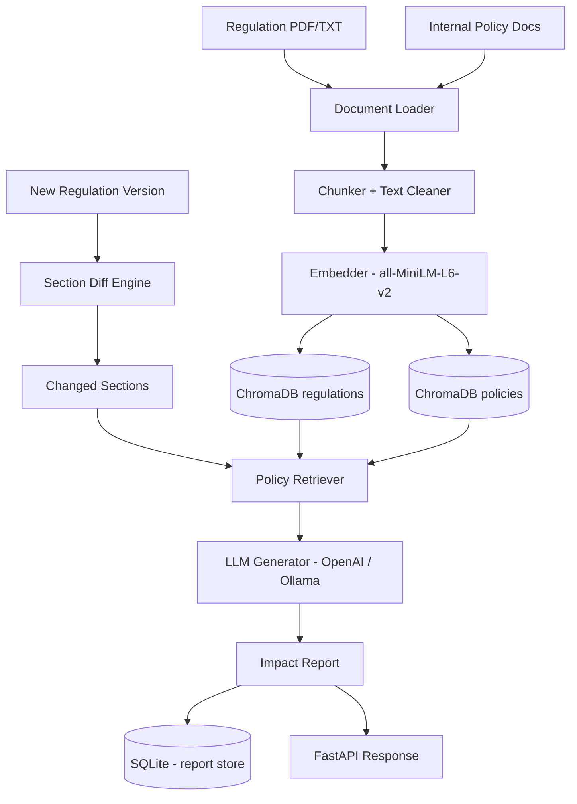

# RegDelta — Regulatory Change Impact Analyzer

> When a regulator amends a rule, which of your internal policies need updating?  
> RegDelta answers that question automatically.

---

## The Problem

Financial institutions operate under a constant stream of regulatory updates — SEC amendments, FINRA guidance updates, Basel revisions. Each change potentially invalidates portions of dozens of internal compliance policies. Today, compliance teams handle this manually: a lawyer reads the new rule, cross-references it against internal policy inventory, and writes memos. At mid-size firms, this takes weeks per major rule change and is error-prone under time pressure.

RegDelta replaces the manual cross-referencing step with a RAG pipeline that ingests both the regulatory corpus and the internal policy corpus, detects section-level changes between regulation versions, and surfaces which policies are semantically affected — along with a generated impact report citing both the regulatory change and the specific policy clauses at risk.

---

## How It Works

```
┌──────────────────────────────────────────────────────────────────────┐
│  Ingestion                                                           │
│  ┌────────────────┐   ┌──────────────────┐   ┌──────────────────┐   │
│  │  Regulation    │   │  Internal Policy │   │  Version         │   │
│  │  PDF / HTML    │──▶│  PDF / TXT       │──▶│  Tracker (SQLite)│   │
│  └────────────────┘   └──────────────────┘   └──────────────────┘   │
│         │                     │                                      │
│         ▼                     ▼                                      │
│  ┌──────────────────────────────────────────────────────────────┐    │
│  │  Chunker → Embedder (all-MiniLM-L6-v2) → ChromaDB           │    │
│  │  Two separate collections: regulations | internal_policies   │    │
│  └──────────────────────────────────────────────────────────────┘    │
└──────────────────────────────────────────────────────────────────────┘

┌──────────────────────────────────────────────────────────────────────┐
│  Analysis  (POST /api/v1/analyze/delta)                              │
│                                                                      │
│  1. Diff Engine         → section-level diff (old vs new version)   │
│  2. LLM Annotation      → significance note per changed section      │
│  3. Dual Retrieval      → changed sections queried against policies  │
│  4. LLM Impact Report   → risk level, actions, affected policies     │
│  5. SQLite persistence  → report stored, retrievable by ID           │
└──────────────────────────────────────────────────────────────────────┘
```

---

## Tech Stack

| Component | Choice | Why |
|---|---|---|
| API Framework | FastAPI | async-native, automatic OpenAPI docs, good for streaming later |
| Embeddings | sentence-transformers `all-MiniLM-L6-v2` | Fast, good retrieval quality, runs on CPU |
| Vector DB | ChromaDB | No external service needed, persistent, cosine similarity built-in |
| LLM | OpenAI `gpt-4o-mini` / Ollama | Swappable; gpt-4o-mini is cheap and good enough for structured report generation |
| Version Tracking | SQLite | Zero-ops, sufficient for the access pattern |
| PDF Parsing | pdfplumber | Handles multi-column PDFs better than PyPDF2 |

---

## Project Structure

```
regdelta/
├── app/                    # FastAPI factory, config, logging
├── ingestion/              # document loading, chunking, embedding, pipeline
├── rag/                    # retriever, LLM generator, impact analyzer
├── api/
│   ├── schemas.py          # Pydantic request/response models
│   └── routes/             # ingest, analyze, query endpoints
├── store/                  # ChromaDB wrapper, SQLite version tracker
├── utils/                  # diff engine, PDF parser, text cleaner
├── models/                 # domain dataclasses (document, impact report)
├── evaluation/             # retrieval recall + report quality scoring
├── tests/                  # pytest test suite
├── scripts/                # seed data, EDGAR fetcher
└── data/                   # sample regulations (SEC 17a-4 v2023/v2024) + policies
```

---

## Setup

### 1. Clone and install

```bash
git clone https://github.com/your-username/regdelta.git
cd regdelta
python -m venv .venv
source .venv/bin/activate   # Windows: .venv\Scripts\activate
pip install -r requirements.txt
```

### 2. Configure

```bash
cp .env.example .env
# Edit .env — at minimum set OPENAI_API_KEY (or switch LLM_PROVIDER=ollama)
```

### 3. Seed sample data

```bash
python scripts/seed_sample_data.py
```

This loads the two included SEC 17a-4 versions (2023 and 2024) and three sample internal policies into ChromaDB.

### 4. Start the API

```bash
uvicorn app.main:app --reload
```

API docs available at `http://localhost:8000/api/v1/docs`

---

### Docker

```bash
docker build -t regdelta .
docker run -p 8000:8000 --env-file .env regdelta
```

---

## Example Usage

### Ingest a regulation version

```bash
curl -X POST http://localhost:8000/api/v1/ingest/regulation \
  -H "Content-Type: application/json" \
  -d '{
    "regulation_id": "SEC-17a-4",
    "regulatory_body": "SEC",
    "title": "Electronic Records Retention Rule",
    "version_tag": "2023",
    "file_path": "data/sample_regulations/sec_17a4_v2023.txt"
  }'
```

### Ingest an internal policy

```bash
curl -X POST http://localhost:8000/api/v1/ingest/policy \
  -H "Content-Type: application/json" \
  -d '{
    "policy_id": "POL-REC-001",
    "title": "Electronic Records Management",
    "department": "Compliance & Operations",
    "file_path": "data/sample_policies/pol_records_management.txt"
  }'
```

### Run impact analysis between two versions

```bash
curl -X POST http://localhost:8000/api/v1/analyze/delta \
  -H "Content-Type: application/json" \
  -d '{
    "regulation_id": "SEC-17a-4",
    "old_version_tag": "2023",
    "new_version_tag": "2024"
  }'
```

### Example response (abbreviated)

```json
{
  "report_id": "a3f2c1d4-...",
  "regulation_id": "SEC-17a-4",
  "old_version": "2023",
  "new_version": "2024",
  "risk_level": "high",
  "executive_summary": "The 2024 amendment extends retention periods from 3 to 7 years and explicitly captures off-channel communications on personal devices. Firms must update archival infrastructure and revise Written Supervisory Procedures to semi-annual review cycles.",
  "affected_policies": [
    {
      "policy_id": "POL-REC-001",
      "title": "Electronic Records Management",
      "department": "Compliance & Operations",
      "relevance_score": 0.912,
      "recommended_action": "Update retention period from 3 years to 7 years; add off-channel communications capture requirement; change WSP review frequency from annual to semi-annual."
    }
  ],
  "recommended_actions": [
    "Extend email and chat archival retention to 7 years across all storage systems.",
    "Implement technical controls to capture WhatsApp/Signal and other off-channel communications.",
    "Revise WSPs review cycle to semi-annual and add off-channel comms section.",
    "Update SLA with third-party storage provider to meet 4-hour examination response requirement.",
    "Establish self-reporting procedure for archival failures per Section 3.2."
  ]
}
```

### Semantic search across policies

```bash
curl -X POST http://localhost:8000/api/v1/query \
  -H "Content-Type: application/json" \
  -d '{"query": "off-channel communications personal devices", "corpus": "policies"}'
```

---

## Running Tests

```bash
pytest tests/ -v
```

---

## Evaluation

```bash
python evaluation/evaluate.py
```

Outputs retrieval Recall@5 across a built-in eval set and (optionally) a rubric-based LLM quality score for a saved report.

---

## Architecture Diagram (Mermaid)



---

## Limitations

- Diff quality degrades on regulations that restructure section numbering between versions — the section splitter relies on heading patterns
- The embedding model (`all-MiniLM-L6-v2`) is general-purpose; a domain-tuned model (e.g. `legal-bert-base-uncased`) would improve recall on dense legal text
- Report generation quality depends heavily on the LLM — `gpt-4o-mini` is adequate but a more capable model produces more actionable outputs
- No authentication on the API — intended for internal deployment behind a network boundary
- Large regulations (500+ pages) will produce many chunks; retrieval quality benefits from the `min_relevance_score` threshold being tuned per corpus

---

## Roadmap

- [ ] FINRA rulebook ingestion via FINRA API
- [ ] Webhook / email notification when new regulation versions are detected
- [ ] Policy gap scoring: quantify what % of a policy needs revision
- [ ] UI dashboard (Streamlit or React) for non-technical compliance staff
- [ ] Fine-tuned embedding model on SEC/FINRA regulatory text
- [ ] Multi-tenant support with per-organization policy vaults

---

## License

MIT
