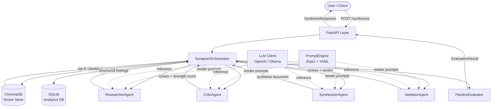
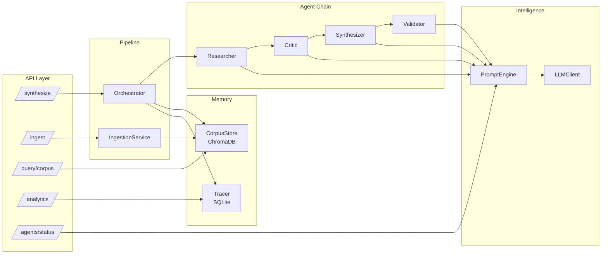

# SynapseIQ — Multi-Agent Research Intelligence & Synthesis Platform
## Complete Project Documentation

---

## 1. Challenge Definition

Modern knowledge work is drowning in documents. Researchers, analysts, and policy teams routinely face corpora of hundreds of papers, reports, and regulatory filings — all of which must be synthesized into a coherent, citable, and actionable output. The manual synthesis process is:

- **Slow**: A skilled analyst takes 2–5 days to produce a synthesis report from 50+ documents
- **Inconsistent**: Output quality varies with analyst expertise, fatigue, and framing bias
- **Unauditable**: The reasoning chain between raw sources and final conclusions is opaque
- **Non-scalable**: Linear effort growth as corpus size increases

Existing LLM-based solutions (simple RAG chatbots, document Q&A tools) address retrieval but not **synthesis quality** — they return relevant chunks without reasoning about gaps, contradictions, or analytical depth.

**SynapseIQ** addresses this gap with a multi-agent pipeline where specialized agents collaborate with distinct roles: one researches, one critiques, one synthesizes, and one validates — producing a rigorously structured, self-evaluated knowledge artifact.

---

## 2. Mission Targets

| # | Target | Measurable Definition of Success |
|---|--------|----------------------------------|
| T1 | Multi-agent synthesis pipeline | 4 specialized agents operating sequentially with shared context |
| T2 | Quality-gated output | Composite score ≥ 0.65 before output is marked PASS |
| T3 | Transparent reasoning chain | Full agent trace stored and retrievable per session |
| T4 | Swappable LLM backend | Works with OpenAI API and local Ollama without code changes |
| T5 | Cost-controlled inference | Per-agent token budgets enforced; cost tracked per session |
| T6 | Evaluable and testable | Retrieval, coherence, relevance, and factuality metrics implemented |
| T7 | Production-ready API | FastAPI with OpenAPI docs, structured logging, health endpoint |

---

## 3. Boundary & Coverage

### In Scope
- Text and PDF document ingestion into a persistent vector corpus
- Multi-agent RAG pipeline: Researcher → Critic → Synthesizer → Validator
- Three output formats: Brief (executive), Standard (structured report), Detailed (full analysis)
- REST API for synthesis, corpus management, and analytics
- Session-level tracing and cost analytics
- Evaluation framework (lexical relevance, structural coherence, LLM-based factuality/rubric scoring)

### Out of Scope
- Real-time web search (corpus is pre-ingested; web retrieval is a planned extension)
- Streaming responses (synchronous only in v1)
- Multi-tenant user isolation (single-tenant deployment in v1)
- UI frontend (API-first; Streamlit dashboard is a roadmap item)
- Fine-tuning or model training (inference-only system)

### Assumptions
- Input documents are in English
- LLM provider is accessible (API key set or Ollama running locally)
- Corpus is pre-ingested before synthesis queries are made

---

## 4. Structural Blueprint — 3D Visual Representation

### Layer Architecture (ASCII 3D View)

```
╔══════════════════════════════════════════════════════════════════════╗
║                     [ PRESENTATION LAYER ]                          ║
║   FastAPI REST API  │  /synthesize  /ingest  /query  /analytics     ║
║   OpenAPI Docs      │  Health Check  │  CORS Middleware              ║
╠══════════════════════════════════════════════════════════════════════╣
║                     [ ORCHESTRATION LAYER ]                          ║
║                                                                      ║
║   ┌──────────────────────────────────────────────────────────────┐  ║
║   │              SynapseOrchestrator                             │  ║
║   │    session_id → context_graph → agent_chain → output        │  ║
║   └──────────────────────────────────────────────────────────────┘  ║
║                              │                                       ║
║         ┌────────────────────┼────────────────────┐                 ║
║         ▼                    ▼                    ▼                  ║
╠══════════════════════════════════════════════════════════════════════╣
║                      [ AGENT LAYER ]                                 ║
║                                                                      ║
║  ┌─────────────┐  ┌─────────────┐  ┌─────────────┐  ┌───────────┐  ║
║  │  RESEARCHER │→ │   CRITIC    │→ │ SYNTHESIZER │→ │ VALIDATOR │  ║
║  │             │  │             │  │             │  │           │  ║
║  │ • Retrieval │  │ • Gap check │  │ • Narrative │  │ • Scoring │  ║
║  │ • Fact ext. │  │ • Bias scan │  │ • Citation  │  │ • Verdict │  ║
║  │ • Structure │  │ • Severity  │  │ • Sections  │  │ • Flags   │  ║
║  └─────────────┘  └─────────────┘  └─────────────┘  └───────────┘  ║
║         │                 │                │               │        ║
║         └─────────────────┴────────────────┘               │        ║
║                      AgentContext (shared)                  │        ║
╠══════════════════════════════════════════════════════════════════════╣
║                      [ INTELLIGENCE LAYER ]                          ║
║                                                                      ║
║  ┌──────────────────┐          ┌──────────────────────────────────┐ ║
║  │  Prompt Engine   │          │        LLM Client                │ ║
║  │                  │          │                                  │ ║
║  │ researcher.yaml  │──render→ │  OpenAI GPT-4o-mini             │ ║
║  │ critic.yaml      │          │  ──── OR ────                   │ ║
║  │ synthesizer.yaml │          │  Ollama (llama3, mistral, etc.)  │ ║
║  │ validator.yaml   │          └──────────────────────────────────┘ ║
║  └──────────────────┘                                               ║
╠══════════════════════════════════════════════════════════════════════╣
║                      [ MEMORY LAYER ]                                ║
║                                                                      ║
║  ┌──────────────────────────────┐  ┌───────────────────────────┐   ║
║  │  ChromaDB Vector Store       │  │  SQLite Analytics DB       │   ║
║  │                              │  │                            │   ║
║  │  • Persistent embeddings     │  │  • pipeline_sessions       │   ║
║  │  • Cosine similarity search  │  │  • agent_traces            │   ║
║  │  • all-MiniLM-L6-v2 model   │  │  • cost tracking           │   ║
║  └──────────────────────────────┘  └───────────────────────────┘   ║
╠══════════════════════════════════════════════════════════════════════╣
║                     [ EVALUATION LAYER ]                             ║
║                                                                      ║
║  Coherence (0.30) │ Relevance (0.35) │ Factuality (0.25) │ Completeness (0.10) ║
║                   └──────────────────┘                             ║
║                         Composite Score → PASS / CONDITIONAL / FAIL ║
╚══════════════════════════════════════════════════════════════════════╝
```

### Mermaid Data Flow Diagram



### Mermaid Component Interaction Map



---

## 5. Codebase Engineering Map — Layered View

```
synapseiq/
│
├── backend/                          ← Core application package
│   │
│   ├── main.py                       ← FastAPI factory + lifespan init
│   │
│   ├── config/
│   │   ├── settings.py               ← Pydantic settings (env-driven)
│   │   └── constants.py              ← Enums, budgets, weight matrices
│   │
│   ├── agents/                       ← Agent implementations
│   │   ├── base.py                   ← BaseAgent + LLMClient abstraction
│   │   ├── researcher.py             ← Extraction + structuring agent
│   │   ├── critic.py                 ← Adversarial review agent
│   │   ├── synthesizer.py            ← Narrative generation agent
│   │   └── validator.py              ← Quality gate agent
│   │
│   ├── prompts/
│   │   ├── engine.py                 ← Jinja2 template renderer + cache
│   │   └── templates/
│   │       ├── researcher.yaml       ← Researcher system + user prompt
│   │       ├── critic.yaml           ← Critic prompt with JSON schema
│   │       ├── synthesizer.yaml      ← Format-conditional synthesis prompt
│   │       └── validator.yaml        ← Rubric-based validation prompt
│   │
│   ├── memory/
│   │   ├── vector_store.py           ← ChromaDB wrapper + embedding
│   │   └── context_graph.py          ← AgentContext + AgentOutput models
│   │
│   ├── pipeline/
│   │   ├── ingestion.py              ← Text/PDF/file ingest → chunks → embed
│   │   └── orchestrator.py           ← Sequential agent pipeline manager
│   │
│   ├── evaluation/
│   │   ├── metrics.py                ← Heuristic + LLM-based metrics
│   │   └── evaluator.py              ← Composite scorer + verdict
│   │
│   ├── logging/
│   │   ├── tracer.py                 ← SQLite session + agent trace store
│   │   └── analytics.py              ← Structured JSON logging + event collector
│   │
│   ├── api/
│   │   ├── schemas.py                ← Pydantic API request/response models
│   │   └── routes/
│   │       ├── synthesis.py          ← /synthesize, /ingest, /query/corpus
│   │       ├── agents.py             ← /agents/status, /agents/prompts/reload
│   │       └── analytics.py          ← /analytics, /analytics/corpus
│   │
│   └── utils/
│       ├── token_counter.py          ← Lightweight token estimation
│       ├── cost_tracker.py           ← Per-session cost accounting
│       └── text_utils.py             ← Normalization, truncation, extraction
│
├── tests/
│   ├── conftest.py                   ← Shared fixtures + mock setup
│   ├── unit/
│   │   ├── test_agents.py            ← Agent behavior unit tests
│   │   └── test_prompts.py           ← Template engine + token counter tests
│   ├── integration/
│   │   └── test_pipeline.py          ← End-to-end pipeline + evaluator tests
│   └── evaluation/
│       └── test_metrics.py           ← Metric function correctness tests
│
├── data/
│   └── sample_corpus/                ← Sample documents for quick start
│       ├── transformers_overview.txt
│       └── llm_finetuning.txt
│
├── docs/
│   └── PROJECT_DOCUMENTATION.md     ← This file
│
├── .env.example
├── requirements.txt
├── Dockerfile
└── README.md
```

---

## 6. Component Deep Dive

### 6.1 SynapseOrchestrator (`pipeline/orchestrator.py`)
The central state machine. Accepts a query string, constructs an `AgentContext`, runs retrieval, then calls each agent in sequence, passing the accumulated context forward. Each agent's output is recorded on the shared context object. If a critical agent fails after retries, the pipeline transitions to `PipelineStage.FAILED` and returns early. The orchestrator is the only component that knows the pipeline order — agents themselves have no awareness of each other.

### 6.2 AgentContext (`memory/context_graph.py`)
The shared mutable object flowing through the pipeline. It holds:
- Retrieved document chunks (post-retrieval)
- Each agent's `AgentOutput` (content + structured JSON + token count + latency)
- Cumulative token total
- Error list
- Session metadata (session_id, query, format, style)

This design means agents communicate through state, not direct calls — making it easy to add, remove, or reorder agents.

### 6.3 PromptEngine (`prompts/engine.py`)
Loads YAML prompt templates at startup, caches them, and renders via Jinja2. Templates define both `system` and `user` prompt components with typed `output_schema` declarations. The `reload()` endpoint allows hot-reloading templates without restarting the server — useful during prompt iteration.

### 6.4 LLMClient (`agents/base.py`)
Thin wrapper supporting OpenAI and Ollama. Both paths return `(content, input_tokens, output_tokens)`. The Ollama path estimates tokens locally when the API doesn't return usage data. JSON extraction handles markdown fence stripping, which LLMs commonly produce despite explicit JSON instructions.

### 6.5 PipelineTracer (`logging/tracer.py`)
SQLite-backed session and agent trace store. Records:
- Session start/end, elapsed time, total tokens, verdict, composite score
- Per-agent call records (agent role, latency, tokens, success)
- Enables the analytics endpoint to surface cost summaries and agent performance stats

### 6.6 PipelineEvaluator (`evaluation/evaluator.py`)
Prefers LLM-generated scores from the Validator agent. Falls back to heuristic metrics (lexical relevance, structural coherence, length completeness) when validation is disabled. Applies the configured weight matrix to produce a composite score and issue a PASS / CONDITIONAL_PASS / FAIL verdict.

---

## 7. Performance Measurement Framework

### 7.1 Retrieval Quality
| Metric | Definition | Target |
|--------|-----------|--------|
| Recall@K | % of relevant docs appearing in top-K results | ≥ 0.70 |
| Mean Reciprocal Rank | Average inverse rank of first relevant result | ≥ 0.60 |
| Relevance Score | Cosine similarity of top hit | ≥ 0.30 threshold |

### 7.2 Synthesis Quality (Rubric-Based)
| Dimension | Weight | Definition |
|-----------|--------|-----------|
| Coherence | 30% | Logical flow, argument connectivity, paragraph structure |
| Relevance | 35% | Degree to which synthesis answers the original query |
| Factuality | 25% | Claims supported by retrieved sources (no hallucination) |
| Completeness | 10% | Coverage of expected topics for the output format |

**Composite Score** = Σ (dimension_score × weight)

**Verdict thresholds**:
- PASS: composite ≥ 0.65
- CONDITIONAL_PASS: composite ≥ 0.45
- FAIL: composite < 0.45

### 7.3 Operational Metrics
| Metric | Tracking Method |
|--------|----------------|
| Per-agent latency (ms) | Recorded in AgentOutput.latency_ms |
| Total pipeline latency | context.elapsed_ms |
| Token consumption per agent | AgentOutput.tokens_used |
| Estimated cost per session | SQLite cost summary query |
| Error rate by agent | agent_traces.success = 0 count |

### 7.4 Prompt Effectiveness Score
After 100+ sessions, the Critic agent's `strength_score` distribution provides a proxy for prompt quality. Consistent strength scores below 0.6 indicate the Researcher prompt needs adjustment; scores above 0.85 suggest the Critic may be too lenient.

---

## 8. Data Engineering Strategy

### 8.1 Corpus Design
The system is domain-agnostic. Any text or PDF corpus can be ingested. Recommended corpus properties:
- **Granularity**: Documents of 500–5000 words each. Very short documents (<100 words) produce noisy chunks; very long documents (>20k words) should be split by section before ingestion.
- **Coherence**: Each document should cover a single topic or subtopic
- **Source diversity**: Multiple perspectives on the same topic improve synthesis quality

### 8.2 Chunking Strategy
Documents are split into overlapping windows:
- `chunk_size`: 700 characters (configurable)
- `chunk_overlap`: 80 characters
- Minimum chunk length: 60 characters (sub-threshold chunks are dropped)
- Section awareness: attempts to split at numbered section boundaries before falling back to character-based windows

### 8.3 Embedding Strategy
`all-MiniLM-L6-v2` produces 384-dimensional embeddings normalized to unit length, enabling cosine similarity via inner product. Embeddings are computed in batches of 32 at ingestion time and stored persistently in ChromaDB.

### 8.4 Sample Corpus
Two domain documents are included under `data/sample_corpus/`:
- `transformers_overview.txt`: Core transformer architecture concepts
- `llm_finetuning.txt`: Fine-tuning methods (LoRA, RLHF, DPO, etc.)

To seed the corpus: `POST /api/v1/ingest` with each file path.

### 8.5 Retrieval Configuration
| Parameter | Default | Effect |
|-----------|---------|--------|
| `retrieval_top_k` | 6 | Number of chunks passed to researcher |
| `min_relevance_score` | 0.30 | Cosine similarity threshold for inclusion |

Increasing `top_k` improves recall but increases LLM context length and cost. The threshold filters semantically distant chunks that would introduce noise.

---

## 9. Technology Stack & Engineering Toolkit

| Category | Technology | Justification |
|----------|-----------|---------------|
| **API Framework** | FastAPI 0.115 | Async-native, auto OpenAPI docs, Pydantic v2 integration |
| **LLM (cloud)** | OpenAI GPT-4o-mini | Low cost ($0.15/1M input tokens), strong instruction following |
| **LLM (local)** | Ollama (llama3/mistral) | Zero API cost, data privacy, offline capability |
| **Embeddings** | sentence-transformers all-MiniLM-L6-v2 | 384-dim, fast CPU inference, strong retrieval performance |
| **Vector DB** | ChromaDB 0.5 | Zero-ops persistent store, cosine similarity, metadata filtering |
| **Prompt Engine** | Jinja2 + PyYAML | Template versioning, conditional sections, typed schemas |
| **Analytics DB** | SQLite | No external service, sufficient for single-tenant analytics |
| **PDF Parsing** | pdfplumber | Better multi-column handling than PyPDF2 |
| **Testing** | pytest + unittest.mock | Standard, well-documented, supports async fixtures |
| **Containerization** | Docker | Reproducible builds, embedded model pre-fetch at build time |

### Design Principles Applied
- **Separation of concerns**: Each module has one job; agents don't know about each other
- **Dependency injection**: Services wired at lifespan, passed via `request.app.state`
- **Fail-safe pipeline**: Agent retries + graceful failure propagation
- **Cost awareness**: Token budgets per agent, cost estimation baked in
- **Prompt-as-config**: YAML templates, not hardcoded strings — hot-reloadable

---

## 10. Environment Bootstrapping Guide

### Prerequisites
- Python 3.11+
- 4GB RAM minimum (8GB recommended if running embedding model + LLM locally)
- Docker (optional)

### Step 1 — Clone and install

```bash
git clone https://github.com/dp2426-NAU/LLM-Project.git
cd synapseiq
python -m venv .venv
source .venv/bin/activate       # Windows: .venv\Scripts\activate
pip install -r requirements.txt
```

### Step 2 — Configure environment

```bash
cp .env.example .env
# Edit .env — minimum required: OPENAI_API_KEY
# Or set LLM_PROVIDER=ollama and install Ollama
```

### Step 3 — Seed the corpus

```bash
# Option A: via API (after starting server)
curl -X POST http://localhost:8000/api/v1/ingest \
  -H "Content-Type: application/json" \
  -d '{"file_path": "data/sample_corpus/transformers_overview.txt", "source_label": "transformers_overview"}'

# Option B: Python script
python -c "
from backend.config.settings import get_settings
from backend.memory.vector_store import CorpusStore
from backend.pipeline.ingestion import IngestionService
s = get_settings()
cs = CorpusStore(s.chroma_persist_dir, s.chroma_collection, s.embedding_model, s.embedding_device)
ing = IngestionService(s, cs)
print(ing.ingest_file('data/sample_corpus/transformers_overview.txt'))
print(ing.ingest_file('data/sample_corpus/llm_finetuning.txt'))
"
```

### Step 4 — Run the server

```bash
uvicorn backend.main:app --reload --port 8000
# API docs: http://localhost:8000/api/v1/docs
```

### Docker

```bash
docker build -t synapseiq .
docker run -p 8000:8000 --env-file .env synapseiq
```

---

## 11. Validation & Quality Assurance Flow

### Running the Test Suite

```bash
pytest tests/ -v

# Run by category
pytest tests/unit/ -v                    # Fast unit tests, no LLM calls
pytest tests/integration/ -v             # Pipeline integration with mocks
pytest tests/evaluation/ -v              # Metric function correctness
```

### Test Architecture

```
tests/
├── conftest.py               ← Shared fixtures: mock LLM, mock store, sample data
├── unit/
│   ├── test_agents.py        ← Agent behavior with mocked LLM responses
│   └── test_prompts.py       ← Template rendering, token counter, cost tracker
├── integration/
│   └── test_pipeline.py      ← Full pipeline, evaluator, context accumulation
└── evaluation/
    └── test_metrics.py       ← Coherence, relevance, completeness, score extraction
```

### Test Cases Summary

| Test | Module | What It Verifies |
|------|--------|-----------------|
| `test_runs_with_valid_chunks` | ResearcherAgent | Agent produces structured output from chunks |
| `test_handles_empty_chunks` | ResearcherAgent | Graceful handling of empty retrieval |
| `test_skips_without_research` | CriticAgent | Critic skips cleanly when upstream fails |
| `test_composite_score_computation` | ValidatorAgent | Weight matrix applied correctly |
| `test_full_pipeline_completes` | Orchestrator | All 4 agents fire, context accumulates correctly |
| `test_pipeline_handles_failure` | Orchestrator | FAILED stage returned on agent error |
| `test_context_token_accumulation` | AgentContext | Token totals are cumulative |
| `test_evaluates_complete_context` | PipelineEvaluator | Composite score in valid range |
| `test_perfect_overlap` | Lexical Relevance | High overlap → high relevance score |
| `test_loads_all_templates` | PromptEngine | All 4 YAML templates loaded |
| `test_cost_estimation` | CostTracker | Token-based cost calculation correct |
| `test_local_model_zero_cost` | CostTracker | Ollama model produces zero cost |

### API Testing (Manual)

```bash
# 1. Health check
curl http://localhost:8000/health

# 2. Check agent status
curl http://localhost:8000/api/v1/agents/status

# 3. Ingest a document
curl -X POST http://localhost:8000/api/v1/ingest \
  -H "Content-Type: application/json" \
  -d '{"file_path": "data/sample_corpus/transformers_overview.txt", "source_label": "transformers"}'

# 4. Run synthesis
curl -X POST http://localhost:8000/api/v1/synthesize \
  -H "Content-Type: application/json" \
  -d '{
    "query": "Explain how multi-head attention works and why it is better than single-head attention",
    "output_format": "standard",
    "citation_style": "inline"
  }'

# 5. View analytics
curl http://localhost:8000/api/v1/analytics
```

---

## 12. Execution Phases & Delivery Roadmap

### Phase 1 — Foundation (Weeks 1–2)
- [x] Project structure and configuration system
- [x] Document ingestion pipeline (text, PDF, directory)
- [x] ChromaDB vector store integration
- [x] Embedding model integration (sentence-transformers)
- [x] Basic FastAPI skeleton with health endpoint

### Phase 2 — Agent Development (Weeks 3–4)
- [x] BaseAgent and LLMClient abstraction
- [x] YAML prompt template system with Jinja2
- [x] ResearcherAgent implementation
- [x] CriticAgent implementation
- [x] SynthesizerAgent with format-conditional output
- [x] ValidatorAgent with rubric scoring

### Phase 3 — Pipeline & Orchestration (Week 5)
- [x] AgentContext shared state model
- [x] SynapseOrchestrator sequential pipeline
- [x] Retry logic and graceful failure handling
- [x] Session tracing and SQLite analytics

### Phase 4 — Evaluation & API (Week 6)
- [x] Evaluation metric implementations
- [x] PipelineEvaluator with composite scoring
- [x] Full REST API with synthesis, ingest, query, analytics routes
- [x] Cost tracking module

### Phase 5 — Testing & Polish (Week 7)
- [x] Unit test suite (agents, prompts, metrics)
- [x] Integration test suite (pipeline, evaluator)
- [x] Docker containerization
- [x] Documentation

### Phase 6 — Extensions (Roadmap)
- [ ] Streamlit UI for non-technical users
- [ ] Web search integration (Tavily or Serper API)
- [ ] WebSocket streaming for real-time agent updates
- [ ] Prompt A/B testing framework
- [ ] Multi-tenant isolation
- [ ] Fine-tuned domain embedding model

---

## 13. Projected System Output & Impact

### Output Artifact
A fully structured synthesis document containing:
- **Sections**: Abstract, Main Findings, Critical Analysis, Conclusions, Open Questions
- **Source Citations**: [S1], [S2] linked to corpus chunks
- **Evaluation Scorecard**: 4-dimension rubric scores + composite + PASS/FAIL verdict
- **Agent Trace**: Full reasoning chain (researcher findings, critic issues, synthesis, validation)
- **Cost Receipt**: Token usage and estimated USD cost per session

### Example Output Structure (Standard Format)
```json
{
  "session_id": "3f7a2b...",
  "synthesis": "ABSTRACT\n...\n\nMAIN FINDINGS\n...\n\nCRITICAL ANALYSIS\n...",
  "evaluation": {
    "coherence_score": 0.82,
    "relevance_score": 0.88,
    "factuality_score": 0.75,
    "completeness_score": 0.80,
    "composite_score": 0.831,
    "verdict": "PASS"
  },
  "agent_traces": [...],
  "pipeline_summary": {
    "total_tokens": 3240,
    "elapsed_ms": 8450,
    "agents_completed": ["researcher", "critic", "synthesizer", "validator"]
  }
}
```

### Academic Impact
- Demonstrates multi-agent LLM system design with separation of concerns
- Implements a self-evaluating AI pipeline with quantified quality metrics
- Shows production-grade engineering patterns (dependency injection, retry logic, structured logging)
- Provides a reusable framework extensible to any knowledge domain

---

## 14. Resource Planning & Cost Optimization

### Token Budget Architecture
Each agent is assigned a maximum token budget enforced before the LLM call:

| Agent | Input Budget | Output Budget | Justification |
|-------|-------------|---------------|---------------|
| Researcher | ~800 tokens | 1,200 tokens | Processes 6 retrieved chunks |
| Critic | ~600 tokens | 800 tokens | Reviews research summary only |
| Synthesizer | ~1,200 tokens | 1,800 tokens | Full synthesis document |
| Validator | ~400 tokens | 600 tokens | Scores synthesis output |

**Estimated per-query cost (GPT-4o-mini)**:
- Total tokens per query: ~5,600 (worst case)
- Cost: ~$0.0014 per query
- 1,000 queries: ~$1.40

### Optimization Strategies

1. **Selective agent activation**: Disable Critic or Validator via `.env` for cost-sensitive deployments
2. **Format-driven token limits**: Brief format caps Synthesizer at 400 output tokens vs. 1,800 for Detailed
3. **Retrieval truncation**: `retrieval_top_k=4` instead of 6 reduces Researcher input by ~30%
4. **Local model fallback**: Ollama (llama3, mistral) eliminates API cost entirely with acceptable quality trade-off
5. **Corpus deduplication**: SHA-256 chunk IDs prevent re-embedding identical content on re-ingestion

### Model Cost Comparison

| Model | Input ($/1M) | Output ($/1M) | Est. cost/1K queries |
|-------|-------------|---------------|---------------------|
| gpt-4o-mini | $0.15 | $0.60 | ~$1.40 |
| gpt-4o | $2.50 | $10.00 | ~$19.20 |
| llama3 (Ollama) | $0 | $0 | $0 (hardware cost) |

---

## 15. Research Sources & Technical Citations

1. Vaswani, A., et al. (2017). *Attention Is All You Need*. NeurIPS. arXiv:1706.03762

2. Hu, E., et al. (2022). *LoRA: Low-Rank Adaptation of Large Language Models*. ICLR 2022. arXiv:2106.09685

3. Ouyang, L., et al. (2022). *Training language models to follow instructions with human feedback (InstructGPT)*. NeurIPS 2022. arXiv:2203.02155

4. Rafailov, R., et al. (2023). *Direct Preference Optimization: Your Language Model is Secretly a Reward Model*. arXiv:2305.18290

5. Lewis, P., et al. (2020). *Retrieval-Augmented Generation for Knowledge-Intensive NLP Tasks*. NeurIPS 2020. arXiv:2005.11401

6. Gao, L., et al. (2023). *Precise Zero-Shot Dense Retrieval without Relevance Labels (HyDE)*. ACL 2023. arXiv:2212.10496

7. Park, J., et al. (2023). *Generative Agents: Interactive Simulacra of Human Behavior*. UIST 2023. arXiv:2304.03442

8. Wang, Y., et al. (2023). *Self-Consistency Improves Chain of Thought Reasoning in Language Models*. ICLR 2023. arXiv:2203.11171

9. Chase, H. (2022). *LangChain: Building applications with LLMs through composability*. GitHub. github.com/langchain-ai/langchain

10. Reimers, N., Gurevych, I. (2019). *Sentence-BERT: Sentence Embeddings using Siamese BERT-Networks*. EMNLP 2019. arXiv:1908.10084

11. ChromaDB Documentation. (2024). *Chroma: The AI-native open-source embedding database*. docs.trychroma.com

12. OpenAI. (2024). *GPT-4o-mini Technical Report*. platform.openai.com/docs/models

---

*Document Version: 1.0 | System: SynapseIQ v1.0.0 | Classification: Academic Submission*
